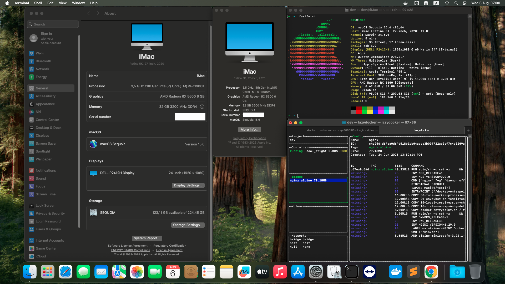

# ASUS B560 PRIME PLUS - HACKINTOSH SEQUOIA

### OpenCore: 1.0.6

- SMBIOS: iMac20,2
- Main: Asus B560 Prime Plus
- VGA: AMD Radeon RX 5600 XT 6GB Phantom Gaming
- CPU: Intel 11th Gen i9-11900K
- RAM: 2 x 16GB 3200Mhz DDR4
- SSD: 512GB (KINGSTON SA2000M8500G)
- Ethernet: Intel I219V14
- WIFI: BCM943602CS + (FIX BY GUI APP: OpenCore-Patcher.app)
- Bluetooth: Not Support ( BCM_4350C2 )
- AirDrop: Not Support
- Thunderbolt: Not Support

### Docker

- Xcode 16.4 + Simulators: YES
- Docker Desktop: YES
- OrbStack: NO

